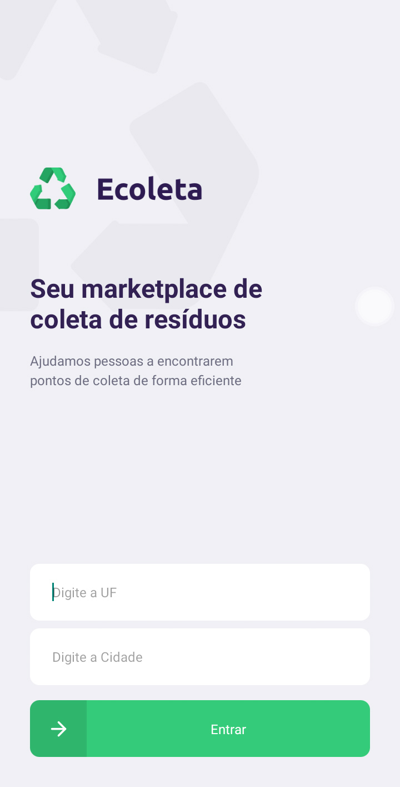
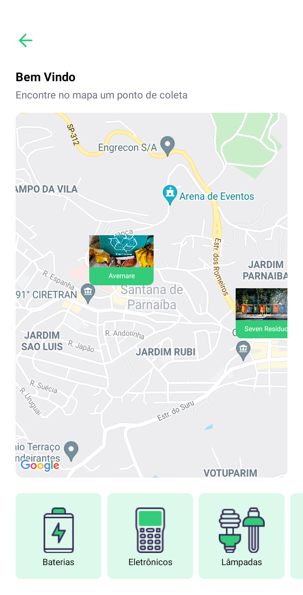
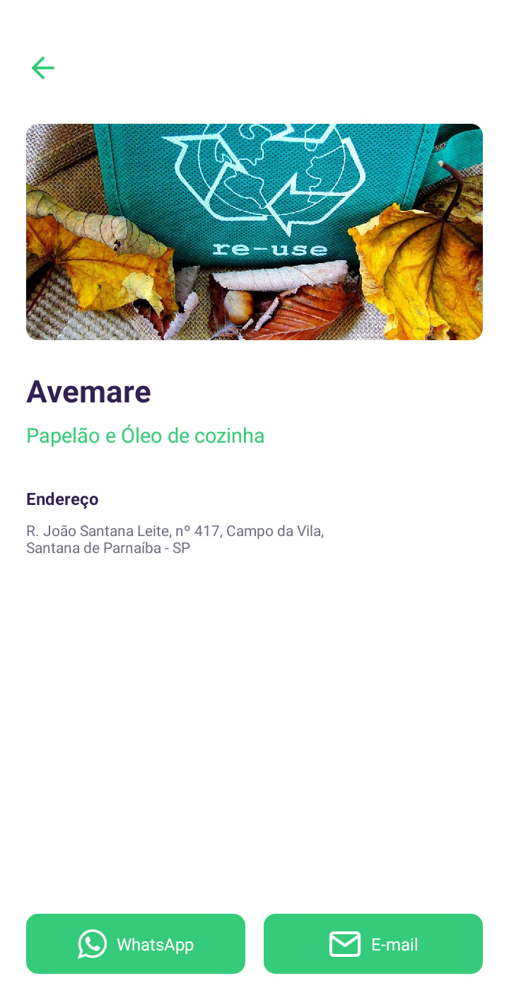

# App Ecoleta
## 💻  Sobre o projeto

♻️  Ecoleta - é uma forma de conectar empresas e entidades de coleta de resíduos orgânicos e inorgânicos as pessoas que precisam descartar seus resíduos de maneira ecológica.

Projeto desenvolvido com ReactNative em aula.

## 🎨  Layout
  
